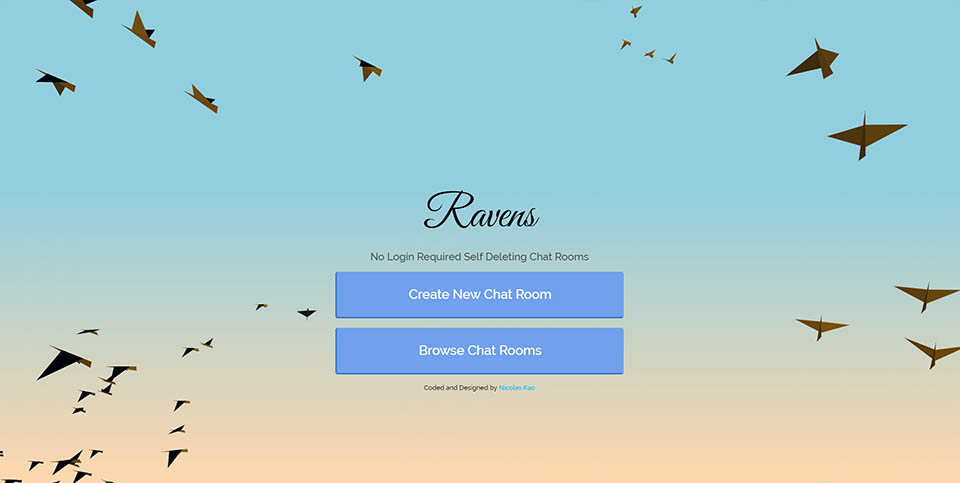
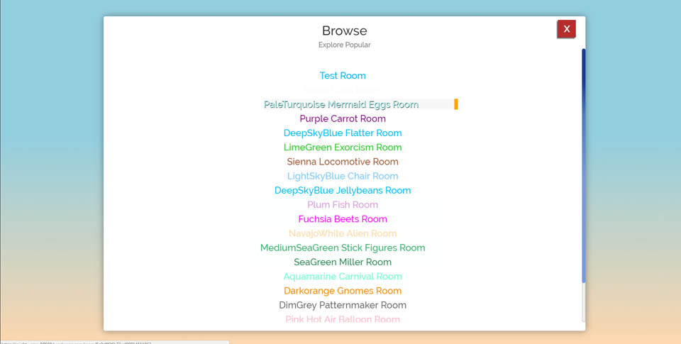

# Ravens

View the live version of this app [here](https://ravens-app.herokuapp.com/) .

## About this project:

Ravens is a chatting app where the rooms have a limited idle time (currently set to 15 minutes), once the time is up, the chatroom will self-delete. 

The idea for this app was to explore Three.js, Socket.io, Node, Express and Mongo. It became too abstract, but it is still useful as a chatroom, the user can create a new room or join existing rooms, share the url and connect with anyone.

## What it looks like:

## Technology:
This app was made with Socket.io, Node.js, Express.js, Mongo and Three.js.

